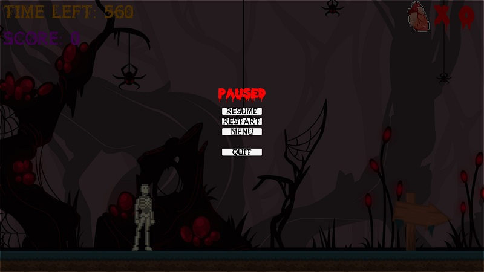
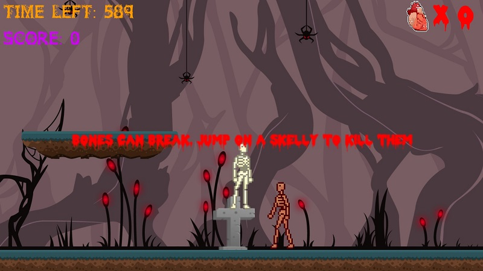

# FMP

<a href="Game.html"> Play.</a>

  
  
This is the title screen i created for the game

  
  
This shows what the game looks like

  
  
This shows the fully working pause menu

  
  
This shows an enemy and how you destroy them

