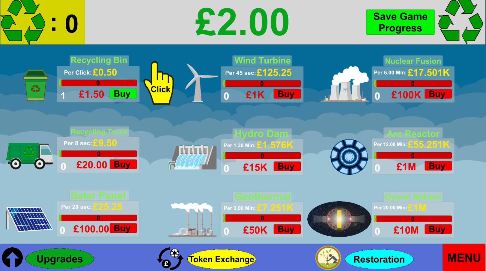
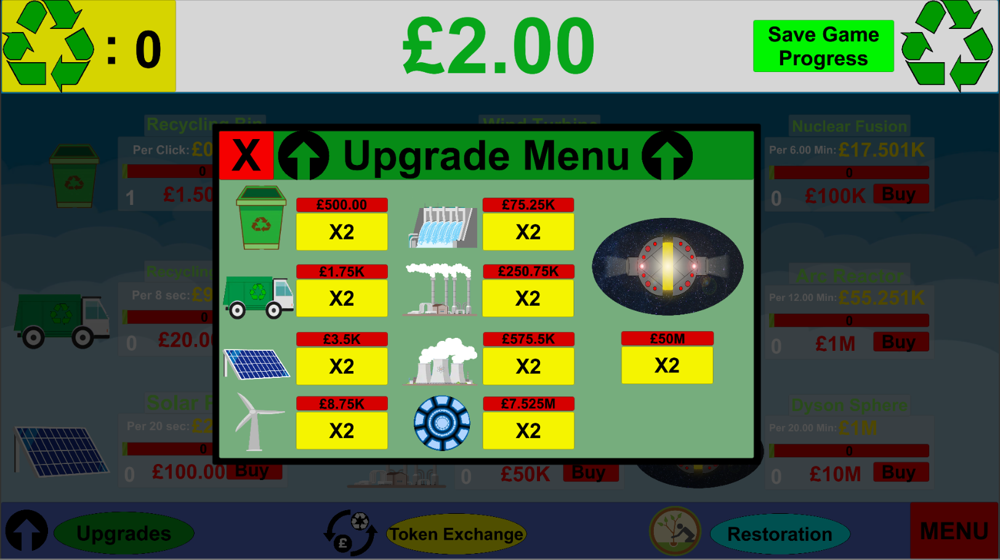
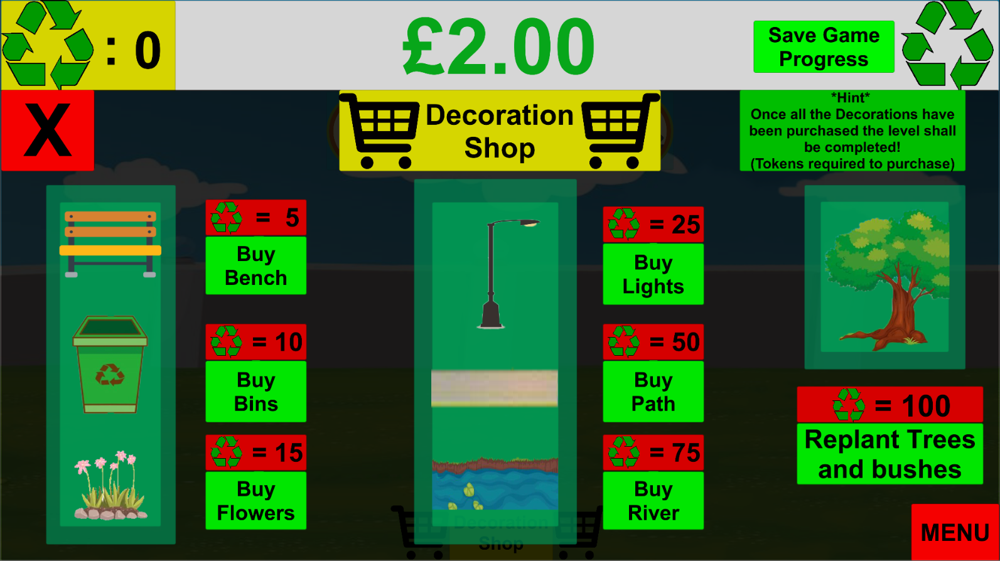

# FMP-Game

<a href="Game.html"> Play.</a>

[Gameplay Of Recycling Tycoon](https://www.youtube.com/watch?v=FUnbJSodNH4)

  
  
This is the area where you buy new money generators 

  
  
This shows the menu which the player is able to buy upgrades for their money generators

  
  
This shows the menu in which the player can convert the money into tokens

  
  
This shows the menu where the player can purchase decorations for their park in order to complete the game

