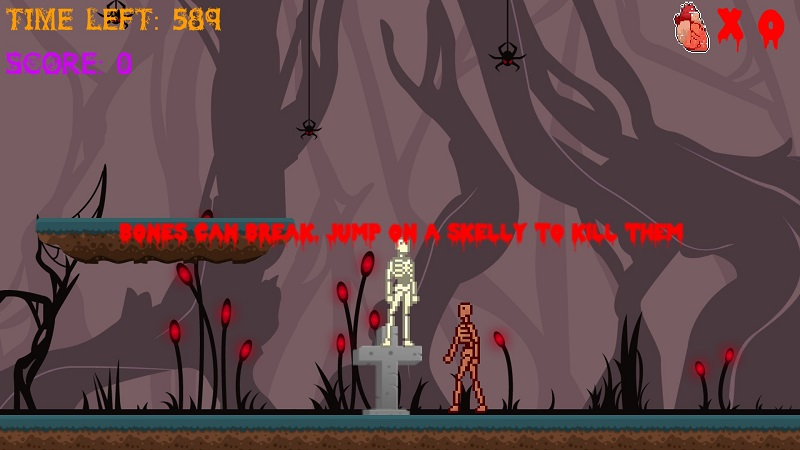

# Gallery
## Year 1 Practical project -Spooky Scary Steve:

  
  
This is the fully working title screen I quickly created for the game

  
  
This shows what the games art style looks like

  
  
This shows the fully working pause menu with all its options

  
  
This shows an enemy and how you destroy them

# Year 2 Practical project - The Museum;

[Gameplay Video of The Museum prototype (Full audio)](https://youtu.be/oX-O31sE2hU)
